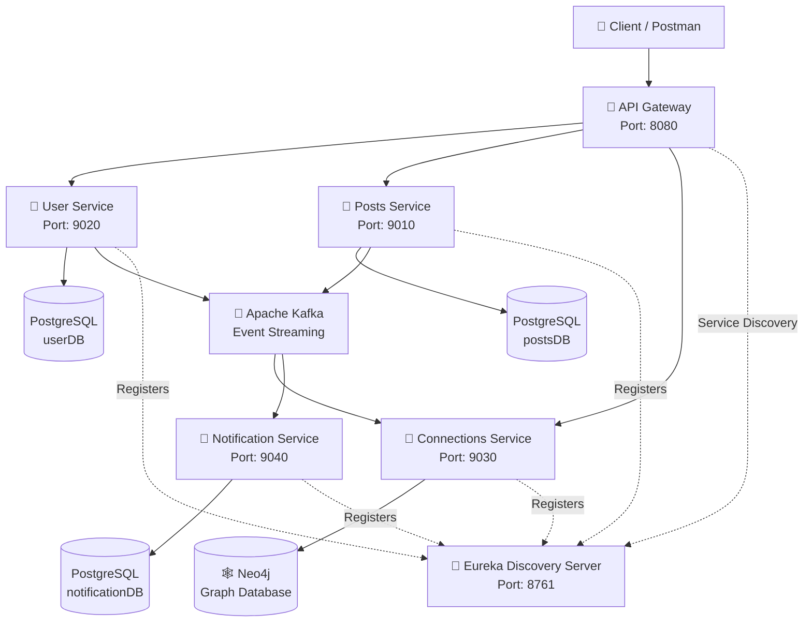
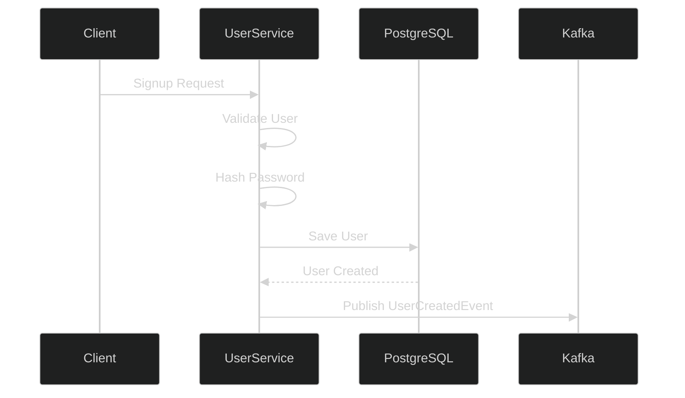
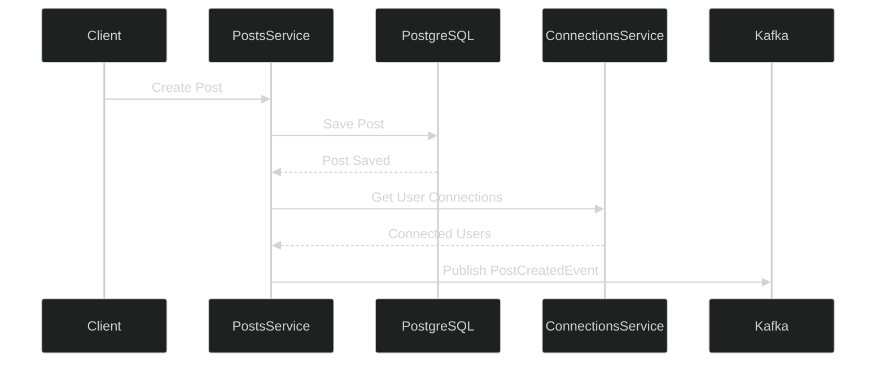

# 🚀 LinkedIn Microservices Platform

> A LinkedIn-inspired professional networking platform built using **Java, Spring Boot, Microservices, Apache Kafka, PostgreSQL, Neo4j, Spring Cloud Gateway, and Eureka**.

This project demonstrates how a modern backend application can be designed using **independently deployable microservices**, combining synchronous REST communication with asynchronous event-driven communication.

---

## 📌 Overview

The platform is divided into multiple services based on business responsibilities.

It supports:

- 👤 User registration and authentication
- 🔐 JWT-based security
- 📝 Creating and managing posts
- ❤️ Liking and unliking posts
- 🤝 Sending and accepting connection requests
- 🕸️ Managing professional relationships using Neo4j
- 🔔 Event-driven notifications using Apache Kafka
- 🔎 Service discovery using Eureka
- 🚪 Centralized request routing using Spring Cloud Gateway

---

# 🏗️ Architecture

🧩 Microservices
👤 User Service

Port: 9020

Responsible for:

User signup
User login
Password hashing
JWT generation
User validation
Publishing user-related events
Flow

📝 Posts Service

Port: 9010

Responsible for:

Creating posts
Fetching posts
Fetching posts by user
Liking posts
Unliking posts
Publishing post-related events

The Posts Service uses OpenFeign for synchronous communication with other services.

Post Creation Flow

🤝 Connections Service

Port: 9030

Responsible for managing professional relationships between users.

Features include:

Send connection request
Accept connection request
Reject connection request
Find first-degree connections

The service uses Neo4j because user relationships can naturally be represented as a graph

Graph Representation
    (User A) ── REQUESTED_TO ──> (User B)
    
    After accepting:
    
    (User A) ── CONNECTED_TO ── (User B)
